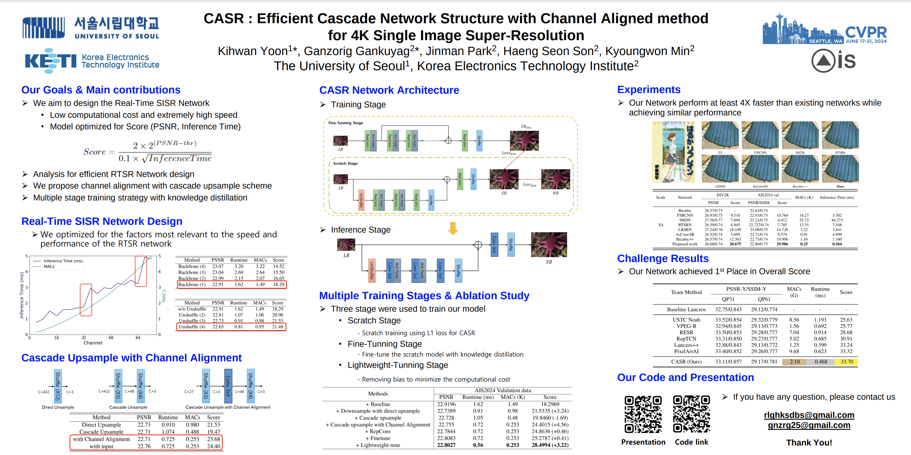
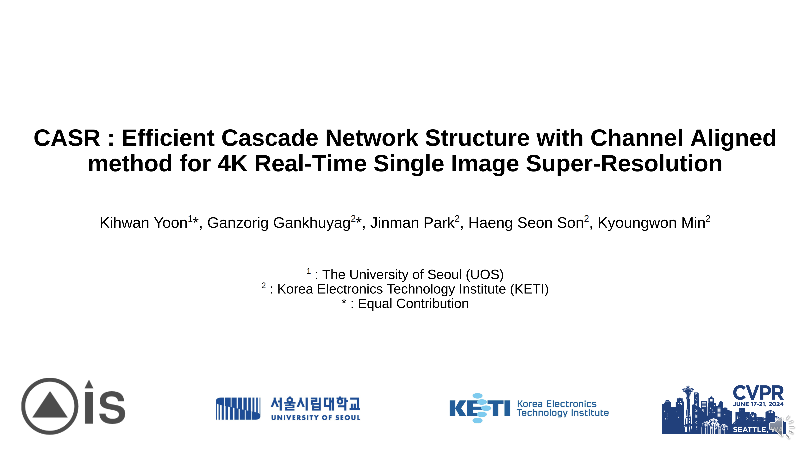
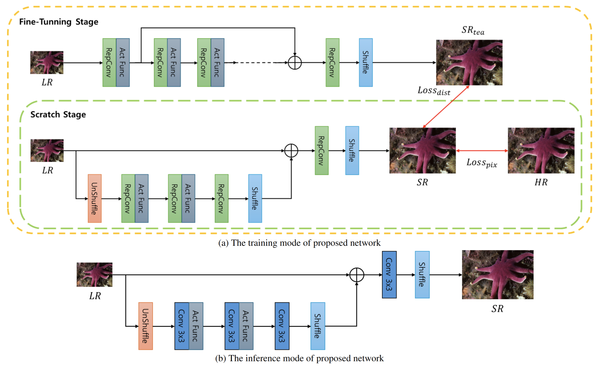
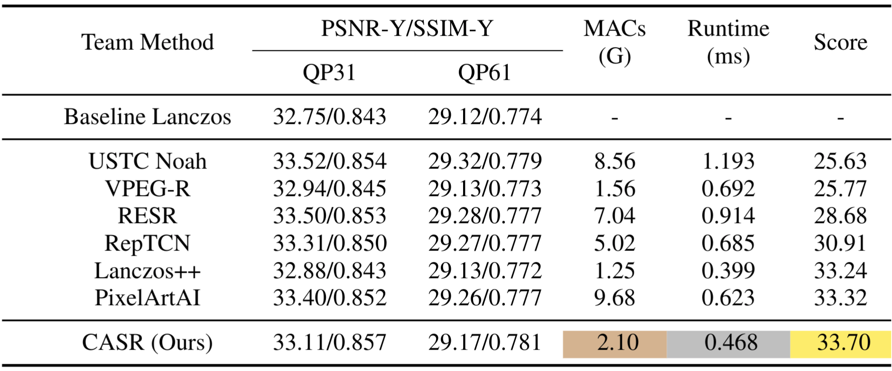

# CASR : Efficient Cascade Network Structure with Channel Aligned method for 4K Real-Time Single Image Super-Resolution

## Achieve 1st Place in CVPR2024 Workshop [AIS2024](https://ai4streaming-workshop.github.io/) RTSR Challenge 🎉
### poster & presentation link
|  |  |
|       :---       |     :---:     |
| <a href="https://drive.google.com/file/d/1VT82c9WSLT6abWeX-eACAgRAtRWBisLk/view?usp=sharing"></a> | <a href="https://drive.google.com/file/d/1XQzTyc29k3zA7sTNjZvcUNlwWIHY8ETE/view?usp=drive_link"></a> |
| | |


# Dependencies & Installation

Please refer to the following simple steps for installation.

```
git clone https://github.com/rlghksdbs/CASR.git
cd CASR
pip install -r requirements.txt
```

# Docker Setting
```
docker build --tag ais2024 .
nvidia-docker run --name ais2024 -it --gpus all --ipc=host --pid=host -v /your/data/path/:/AIS2024/dataset -v /your/sorce_code/:/AIS2024/source_code --shm-size=64g ais2024:latest
pip install -U numpy

##If you use RTX A6000
pip install torch==1.12.0+cu116 torchvision==0.13.0+cu116 torchaudio==0.12.0 --extra-index-url https://download.pytorch.org/whl/cu116
```

# Prepare Dataset

## Download Train & Test Dataset
AIS2024 dataset from Web [AIS2024](https://drive.google.com/drive/folders/1mD9bNoZDywvobOk1XrZupYKACF_nKN5t?usp=drive_link)

Div2k train dataset from Web [DIV2K](https://drive.google.com/drive/folders/1GKGXR9vwLHc8Lbuaw9SRQOyYqpM578df?usp=drive_link)

Div2k validation bicubic dataset from Web [validation](https://drive.google.com/drive/folders/1_aVOZLJ5jjRxg9sBrUrR-X87jFkdV2eD?usp=drive_link)

Path of Dataset must be set in ./config/*name_of_yaml*.yaml

### Dataset preparation for AVIF LR images
You can generate LR images with compression noise. (FFMpeg 6.1 Version)
```
## LR path & HR path must be set by manually
python png2avif.py 
```

### Dataset preparation for Noised LR images
You can generate LR images with compression noise.
```
## LR path & HR path must be set by manually
python source/data/prepare_data.py 
```

### Training
You could also try less/larger batch-size, if there are limited/enough hardware resources in your GPU-server.
We use simple yamlfile for various settings during training. 
You can set all Parameters at yaml file ***./config/name_of_model.yaml***
```
cd CASR

## Scratch Stage
sh train_scratch.sh

## Fine-Tunning Stage
sh train_finetune.sh

## Lightweight-Tunning Stage
sh train_lasttune.sh
```
### Testing
You can set all Parameters in ***./config/config_base_test.yaml***

```
## For test your model use sr_demo to check inference time.
python sr_demo.py
```

### Check Result
Validation result image, Test result image, Best weight, Last weight and log files saved in this ***./output/{DATE_of_TODAY}/{Last_folder}*** folder.
Wandb result [WANDB](https://wandb.ai/iilab/ECCV_MAI2020_SR)

### Profilling model inference time
You can check ideal model inference time by pytorch profilling tool. You can set all Parameters in ***./config/config_base.yaml***
```
## If you set all settings correct
python profiller_model.py
```

# CASR Network Architecture & Challenge Results

## Architecture


## AIS2024 Results
